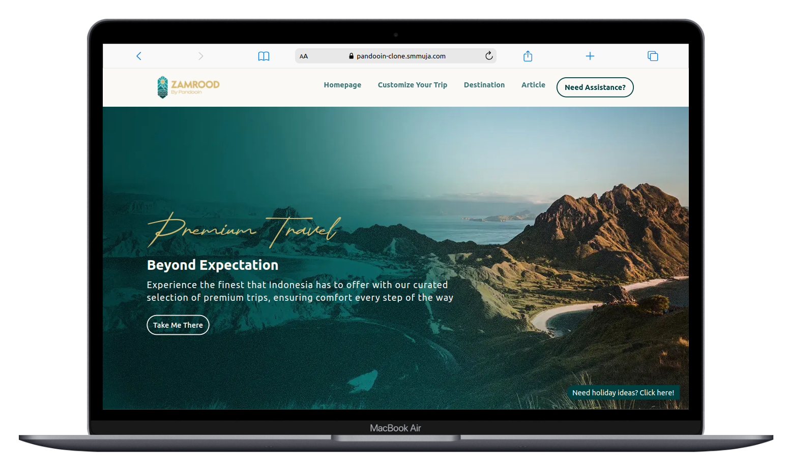

# Pandooin Clone

## Cloned from Zamrood by Pandooin : https://www.zamrood.com

## Deployment : https://pandooin-clone.smmuja.com

## Tech stack

### Languages

- TypeScript
- JavaScript
- HTML
- CSS

### Libraries and dependencies

- Next Js
- Yarn
- Axios
- React query
- Tailwind CSS

### Design Tools

- Figma

## View

### Desktop

- Desktop Hero  
  

- Desktop Destination  
  

- Desktop Footage  
  

- Desktop Article  
  

### Mobile

- Mobile Hero  
  

- Mobile Destination  
  

- MObile Footage Carousel  
  

- Mobile Article  
  

### Install dependencies

```bash

yarn

```

### Run development server

```bash

yarn dev

```

### Test build

```bash

yarn build

```

```bash

yarn start

```

## Folder Structure

```
pandooin/
│
├───public
│ ├───assets
│ │ ├───doc
│ │ │ └───(Related documents like PDFs, guides, etc.)
│ │ ├───icons
│ │ │ └───(Application icons such as logo.svg, favicon.ico)
│ │ └───images
│ │ └───(Application images, like banners, background images)
│ └───(Other public assets such as static files, robots.txt, etc.)
│
├───src
│ ├───api
│ │ └───(api functions)
│ ├───components
│ │ └───(Reusable React components)
│ ├───config
│ │ └───(Config variables)
│ ├───features
│ │ └───(Wrapper/Container for pages for modularization and scalability )
│ ├───layout
│ │ └───(Define layouts accross pages)
│ ├───pages
│ │ └───(Next.js pages, e.g., index.tsx, about.tsx)
│ ├───styles
│ │ └───(Global and component-specific CSS/SCSS files)
│ ├───hooks
│ │ └───(Custom React hooks)
│ ├───utils
│ │ └───(Utility functions, helpers, constants)
│ └───(Other source files like context, services, etc.)
│
├───.next
│ └───(Automatically generated by Next.js; holds build files)
│
├───node_modules
│ └───(Dependencies installed via npm or yarn)
│
├───.gitignore
│ └───(Files and directories to be ignored by Git)
│
├───package.json
│ └───(Project metadata and dependency management)
│
├───tsconfig.json
│ └───(TypeScript configuration)
│
└───README.md
└───(Project overview and instructions)

```

This is a [Next.js](https://nextjs.org/) project bootstrapped with [`create-next-app`](https://github.com/vercel/next.js/tree/canary/packages/create-next-app).

## Getting Started

First, run the development server:

```bash
npm run dev
# or
yarn dev
# or
pnpm dev
# or
bun dev
```

Open [http://localhost:3000](http://localhost:3000) with your browser to see the result.

You can start editing the page by modifying `pages/index.tsx`. The page auto-updates as you edit the file.

[API routes](https://nextjs.org/docs/api-routes/introduction) can be accessed on [http://localhost:3000/api/hello](http://localhost:3000/api/hello). This endpoint can be edited in `pages/api/hello.ts`.

The `pages/api` directory is mapped to `/api/*`. Files in this directory are treated as [API routes](https://nextjs.org/docs/api-routes/introduction) instead of React pages.

This project uses [`next/font`](https://nextjs.org/docs/basic-features/font-optimization) to automatically optimize and load Inter, a custom Google Font.

## Learn More

To learn more about Next.js, take a look at the following resources:

- [Next.js Documentation](https://nextjs.org/docs) - learn about Next.js features and API.
- [Learn Next.js](https://nextjs.org/learn) - an interactive Next.js tutorial.

You can check out [the Next.js GitHub repository](https://github.com/vercel/next.js/) - your feedback and contributions are welcome!

## Deploy on Vercel

The easiest way to deploy your Next.js app is to use the [Vercel Platform](https://vercel.com/new?utm_medium=default-template&filter=next.js&utm_source=create-next-app&utm_campaign=create-next-app-readme) from the creators of Next.js.

Check out our [Next.js deployment documentation](https://nextjs.org/docs/deployment) for more details.
